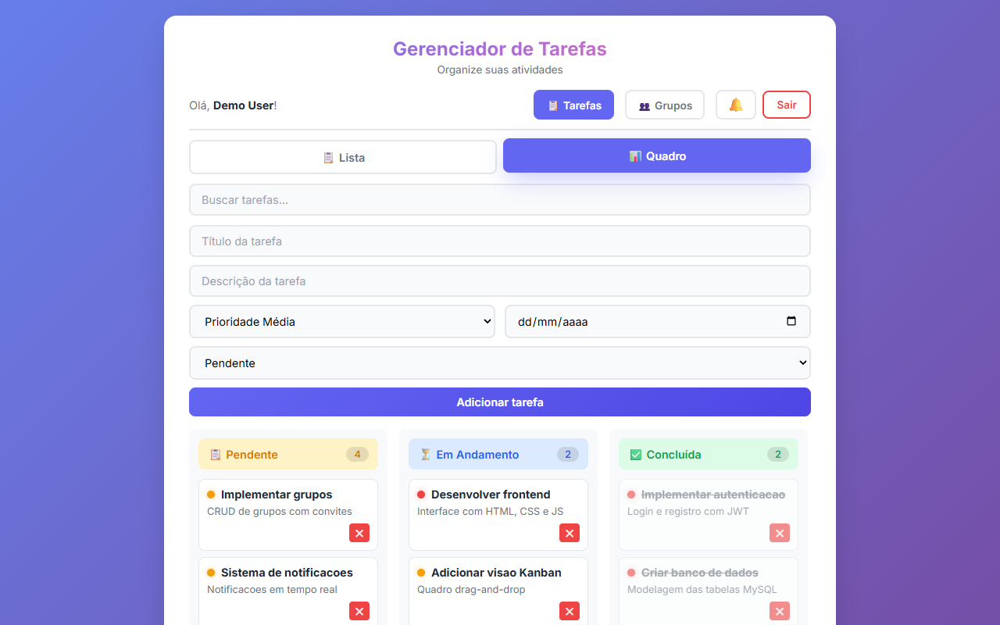

# Gerenciador de Tarefas

[](LICENSE)
[](https://nodejs.org)
[](https://gerenciador-tarefas-v2-production.up.railway.app)

Sistema completo de gerenciamento de tarefas com autenticação de usuários, visão Kanban, **grupos com membros**, notificações e drag & drop. Projeto desenvolvido para a matéria de Projeto de Software.

> 🔗 **Deploy:** [gerenciador-tarefas-v2-production.up.railway.app](https://gerenciador-tarefas-v2-production.up.railway.app)



---

## Funcionalidades

- **Autenticação de usuários** — Registro e login com JWT
- **CRUD completo** — Criar, listar, atualizar e deletar tarefas
- **Visão Kanban** — Quadro com colunas Pendente / Em Andamento / Concluída
- **Visão em lista** — Visualização tradicional com filtros por status
- **Prioridade** — Alta, média ou baixa com indicadores visuais
- **Prazo** — Data limite com alerta visual de atraso
- **Busca** — Filtro por título ou descrição
- **Drag & Drop** — Arrastar tarefas entre colunas no Kanban (desktop e mobile)
- **Reordenação** — Mover tarefas para cima/baixo na lista
- **Grupos** — Criar grupos, convidar membros via código, gerenciar permissões
- **Tarefas em grupo** — Atribuir tarefas a membros, edição colaborativa
- **Notificações** — Sino com badge de não lidas, notificações de atribuição e conclusão
- **Sanitização** — Proteção contra XSS nos inputs
- **Responsivo** — Layout adaptado para desktop, tablet e mobile
- **Dados persistentes** — Armazenamento em MySQL

## Arquitetura (3 Camadas)

| Camada | Tecnologia |
|--------|------------|
| **Front-end** | HTML5, CSS3 (Vanilla), JavaScript (Vanilla) |
| **Back-end** | Node.js + Express |
| **Banco de Dados** | MySQL |

## Pré-requisitos

- Node.js v14+
- MySQL 5.7+
- npm

## Instalação

```bash
git clone https://github.com/WesleySFA/gerenciador-tarefas-v2.git
cd gerenciador-tarefas-v2
npm install
```

### Configuração

Copie o arquivo `.env.example` para `.env` e ajuste as credenciais:

```env
DB_HOST=localhost
DB_USER=root
DB_PASSWORD=sua_senha
DB_NAME=tarefas_db
JWT_SECRET=sua-chave-secreta-aqui
PORT=3000
```

O banco de dados é criado automaticamente na primeira execução.

### Iniciar

```bash
npm start
```

Acesse em [http://localhost:3000](http://localhost:3000)

### Desenvolvimento

```bash
npm run dev
```

(Requer Node.js 18+ para `--watch` nativo)

## Deploy no Railway

```bash
railway login
railway up
```

O arquivo `railway.json` já está configurado. O deploy usa o builder Nixpacks e faz health check na rota `/health`.

## Estrutura do Projeto

```
gerenciador-tarefas/
├── public/
│   ├── index.html          # Página principal (SPA)
│   ├── css/
│   │   ├── base.css        # Estilos base (sempre carrega)
│   │   ├── desktop.css     # Desktop (min-width: 769px)
│   │   ├── tablet.css      # Tablet (481px-768px)
│   │   └── mobile.css      # Mobile (max-width: 480px)
│   └── js/
│       ├── shared.js       # Lógica principal (sempre carrega)
│       ├── desktop.js      # Específico desktop
│       └── mobile.js       # Touch drag no mobile
├── index.js                # Servidor Express (backend)
├── groups.js               # Rotas de grupos (backend)
├── .env.example            # Exemplo de variáveis de ambiente
├── railway.json            # Configuração de deploy Railway
├── package.json            # Dependências do projeto
└── README.md               # Documentação
```

## API Endpoints

### Autenticação

| Método | Rota | Descrição |
|--------|------|-----------|
| POST | `/register` | Registrar novo usuário |
| POST | `/login` | Autenticar usuário |
| GET | `/me` | Dados do usuário logado |

### Tarefas Individuais

| Método | Rota | Descrição |
|--------|------|-----------|
| GET | `/tasks` | Listar tarefas do usuário |
| POST | `/tasks` | Criar nova tarefa |
| PUT | `/tasks/:id` | Atualizar tarefa (status, prioridade, prazo, ordem) |
| DELETE | `/tasks/:id` | Excluir tarefa |

### Grupos

| Método | Rota | Descrição |
|--------|------|-----------|
| GET | `/api/groups` | Listar grupos do usuário |
| POST | `/api/groups` | Criar novo grupo |
| GET | `/api/groups/:id` | Detalhes do grupo (membros, código de convite) |
| POST | `/api/groups/join` | Entrar em um grupo via código de convite |
| POST | `/api/groups/:id/invite` | Gerar novo código de convite |
| DELETE | `/api/groups/:id` | Excluir grupo (apenas owner) |
| DELETE | `/api/groups/:id/members/:userId` | Remover membro (apenas owner) |
| POST | `/api/groups/:id/leave` | Sair do grupo |

### Tarefas em Grupo

| Método | Rota | Descrição |
|--------|------|-----------|
| GET | `/api/groups/:id/tasks` | Listar tarefas do grupo |
| POST | `/api/groups/:id/tasks` | Criar tarefa no grupo |
| PUT | `/api/groups/:id/tasks/:taskId` | Atualizar tarefa (status, prioridade, atribuição) |
| DELETE | `/api/groups/:id/tasks/:taskId` | Excluir tarefa do grupo |

### Notificações

| Método | Rota | Descrição |
|--------|------|-----------|
| GET | `/notifications` | Listar notificações do usuário |
| PUT | `/notifications/:id/read` | Marcar notificação como lida |
| PUT | `/notifications/read-all` | Marcar todas como lidas |
| GET | `/notifications/unread-count` | Contagem de não lidas |

### Saúde

| Método | Rota | Descrição |
|--------|------|-----------|
| GET | `/health` | Status do servidor e banco |

## Tecnologias

- [Express](https://expressjs.com/)
- [MySQL2](https://github.com/sidorares/node-mysql2)
- [JSON Web Token](https://jwt.io/)
- [bcryptjs](https://github.com/dcodeIO/bcrypt.js)
- [Helmet](https://helmetjs.github.io/)
- [dotenv](https://github.com/motdotla/dotenv)

## Licença

Distribuído sob a licença MIT. Veja [LICENSE](LICENSE) para mais informações.

---

**Equipe:** Wesley Silva Ferreira Amaro ([@WesleySFA](https://github.com/WesleySFA))
